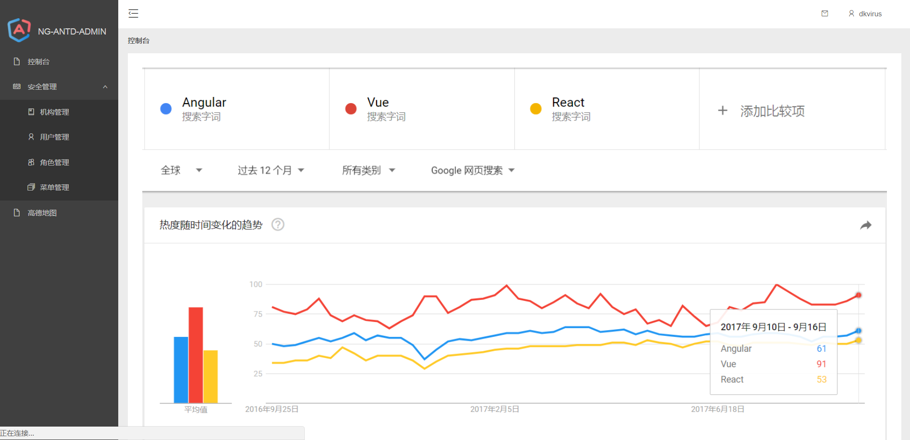
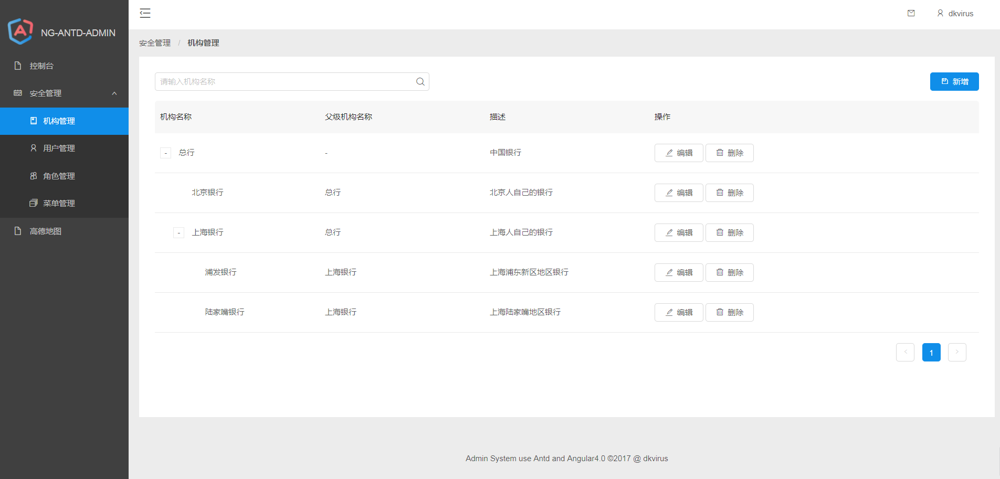

# ng-antd-admin
> admin system use angular4.0 and antd

## 特性

- 基于 Angular4.0 和阿里云的 NG-ZORRO UI 框架搭建的后台管理系统。

## 快速开始

- 下载代码

```
$ git clone git@github.com:dkvirus/ng-antd-admin.git
```

- 安装依赖包
```
$ cd ng-antd-admin
$ npm install
```

- 启动项目

```
$ ng server 
```

访问浏览器：`localhost:4200`

## 页面展示





## 资料

[大漠之秋大牛的 Nicefish 项目](https://github.com/damoqiongqiu/NiceFish)

[阿里云 UI 框架：NG-ZORRO](https://ng.ant.design/#/docs/angular/introduce)
